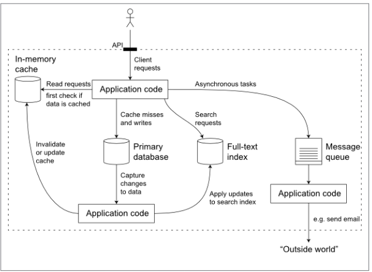

# 3 Main goals
1. Reliable
2. Scalable
3. Maintainable

## Reliablity
* The application performs the function that user expected.
* It can telorance The user making mistaks or using software in unexpected ways.
* Its performance is good enough for the required use case, under the expected load and data volume.
* The system prevents any unexpected access or abuse.
If all those things together mean "working correctly" then we can underestand reliability as meaning "continuing to work correctly, even when things go wrong"

### Faults and Errors 
* Hardware Faults : hardware redundancy to replace new hardware 
* Software Errors : monitoring and testing in isolated 
* human Errors :
   * Design systems in the way that minimize opportunities for errors.
   * Decouple the places that people make most mistakes from the places that can cause failure
   * Test thoroughly all levels from unit test to whole-system integration test and manual tests
   * Quick recovery and fast rollback configurations changes and provide tools for recompute 
   * set up detailed and clear monitoring
   * Implement good management practice and training

> Note : Hadoop is an open source distributed batch processing framework that manages data processing and storage for big data applications running in clustered systems.

## Scalability
### Load:
Presure is a system like a more user request or havier database
### Performance:
1. When Increase load parameter and keep resources unchanged how your performance affects ?
2. When Increase load parameter How much do you need to incrace resources to keep performance same ?

stateless applications can disterbute.
when to disterbute?
1. read limitation of hard
2. write limitation of hard
3. storage space is limited
4. incrace number of requests per second

## Maintaiability
keep a system oprational, investigating bugs, adapting to new platforms, modifing for new use cases,repaying technical dept, adding new features.  
Design principles for software :
1. Oprability :  
Make it easy for oprations team to keep the system running smothly.
keep routing tasks easy and automated to operations team focus on more important tasks.
provide good default values but give administrators ability to change them.
2. Simplicity  
Make it easy for new enginiering to understane the system, by removing as much compexity as possible from the system.(Note this is not the same as simplicity of the user interface).  
symptoms of complexity:
   * explanation of the state space
   * tight coupling of modules 
   * tangled dependencies
   * inconsictence naming and terminology
   * hacks aimed at solving performance problems
   * special-casting to work around issues elsewhere
   * etc
Abstraction can help us to simplify system but a good defined abstraction.
3. Evolvability  
Make it easy for enginiering to make change to the system in the future, adapting it for unanticipated use cases as requirments change. also known as extensibility, modifiability, or plasticity.
increase ability of system for making it easy-to-change.

