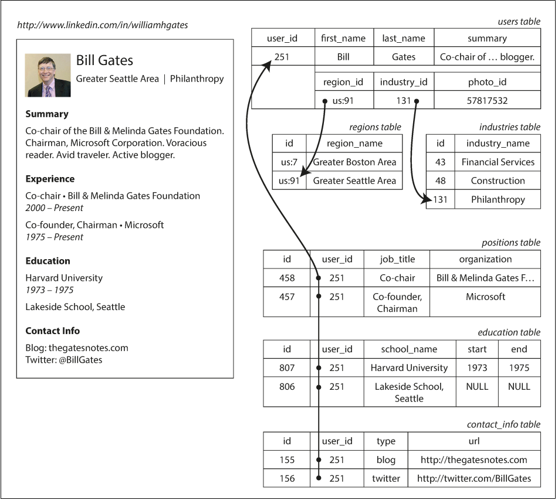
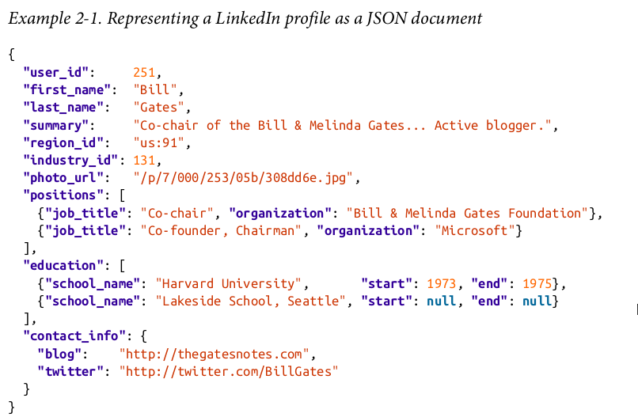
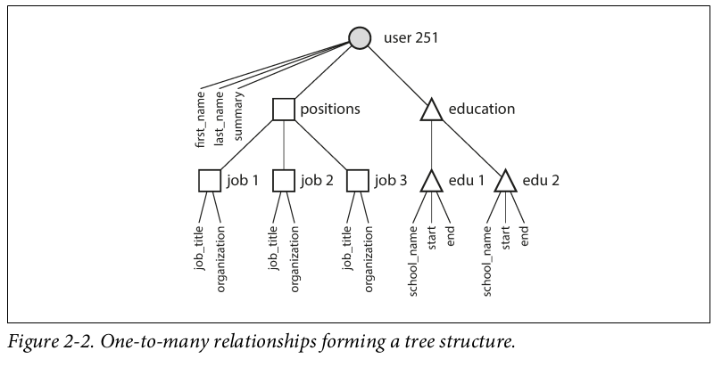
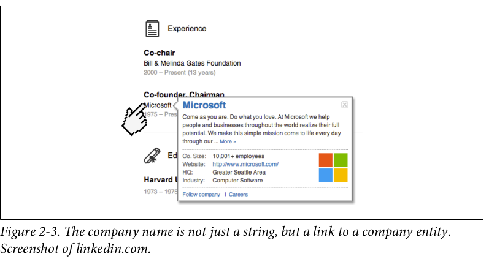
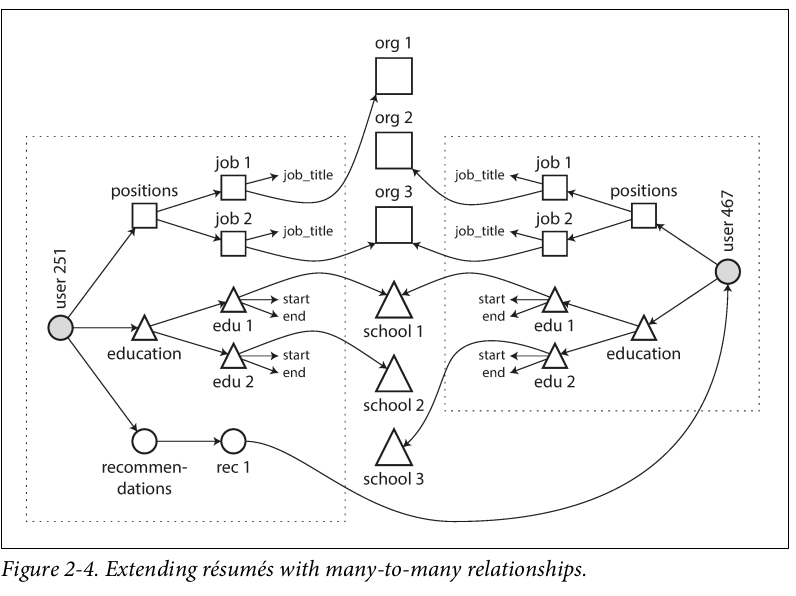
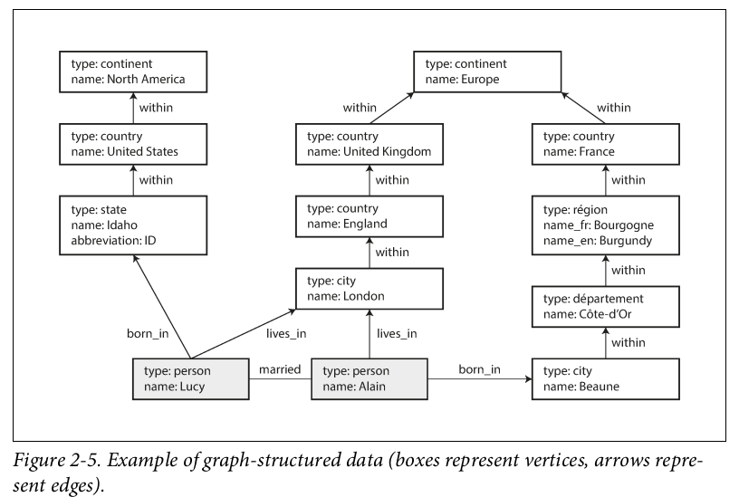
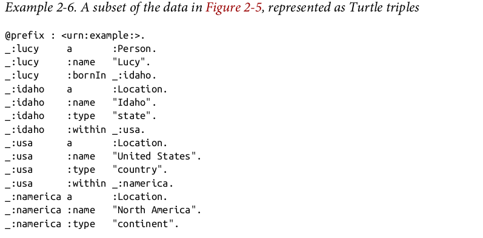
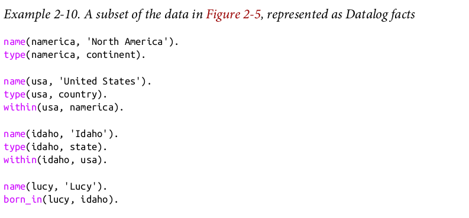

# Data Models and Query Languages

## Relational Model Versus Document Model
The best-known data model today is probably that of SQL, based on the relational
model. The goal of the relational model was to hide that implementation detail behind a cleaner interface.Query language like sql give more room to database for optimizing and paralelizing but not sure on data order.
### Representing a LinkedIn profile using a relational schema.
 Photo of Bill Gates courtesy of Wikimedia Commons, Ricardo Stuckert, Agência Brasil.



### Representing a LinkedIn profile as a JSON document



The JSON representation has better locality than the multi-table schema in. If you want to fetch a profile in the relational example, you need to either
perform multiple queries (query each table by user_id ) or perform a messy multi-
way join between the users table and its subordinate tables. In the JSON representa‐
tion, all the relevant information is in one place, and one query is sufficient.



For many-to-one relationships we can use id instade of plain-text like this : 



### Extending resumes with many-to-many relationships :



## The network model
For example, there could be one
record for the "Greater Seattle Area" region, and every user who lived in that
region could be linked to it. This allowed many-to-one and many-to-many relation‐
ships to be modeled.The links between records in the network model were not foreign keys, but more like pointers in a programming language (while still being stored on disk).

## Comparison to document databases
Document databases reverted back to the hierarchical model in one aspect: storing
nested records (one-to-many relationships, like positions , education , and
contact_info in Figure 2-1) within their parent record rather than in a separate
table.
However, when it comes to representing many-to-one and many-to-many relation‐
ships, relational and document databases are not fundamentally different: in both
cases, the related item is referenced by a unique identifier, which is called a foreign
key in the relational model and a document reference in the document model.
That identifier is resolved at read time by using a join or follow-up queries.

## Data locality for queries
A document is usually stored as a single continuous string, encoded as JSON, XML,
or a binary variant thereof (such as MongoDB’s BSON). If your application often
needs to access the entire document (for example, to render it on a web page), there is
a performance advantage to this storage locality. If data is split across multiple tables

## Query Languages for Data
Many commonly used programming languages are imperative. For example, if you
have a list of animal species, you might write something like this to return only the
sharks in the list:
```js

function getSharks() {
var sharks = [];
for (var i = 0; i < animals.length; i++) {
if (animals[i].family === "Sharks") {
sharks.push(animals[i]);
}
}
return sharks;
}

```

```sql

SELECT * FROM animals WHERE family = 'Sharks';

```

## Declarative Queries on the Web
Say you have a website about animals in the ocean. The user is currently viewing the
page on sharks, so you mark the navigation item “Sharks” as currently selected, like
this:
```xml

<ul>
    <li class="selected">
        <p>Sharks</p>
        <ul>
            <li>Great White Shark</li>
            <li>Tiger Shark</li>
            <li>Hammerhead Shark</li>
        </ul>
    </li>
    <li>
        <p>Whales</p>
        <ul>
            <li>Blue Whale</li>
            <li>Humpback Whale</li>
            <li>Fin Whale</li>
        </ul>
    </li>
</ul>

```

Now say you want the title of the currently selected page to have a blue background,
so that it is visually highlighted. This is easy, using CSS:

```css 

li.selected > p {
background-color: blue;
}

```

If you were using XSL instead of CSS, you could do something similar:
```xml

<xsl:template match="li[@class='selected']/p">
    <fo:block background-color="blue">
        <xsl:apply-templates/>
    </fo:block>
</xsl:template>

```

Imagine what life would be like if you had to use an imperative approach. In Java‐
Script, using the core Document Object Model (DOM) API, the result might look
something like this:

```javascript

var liElements = document.getElementsByTagName("li");
for (var i = 0; i < liElements.length; i++) {
    if (liElements[i].className === "selected") {
        var children = liElements[i].childNodes;
        for (var j = 0; j < children.length; j++) {
            var child = children[j];
            if (child.nodeType === Node.ELEMENT_NODE && child.tagName === "P") {
                child.setAttribute("style", "background-color: blue");
            }
        }
    }
}

```

## Graph-Like Data Models



### Property Graphs
In the property graph model, each vertex consists of:
* A unique identifier
* A set of outgoing edges
* A set of incoming edges
* A collection of properties (key-value pairs)
### Each edge consists of:
* A unique identifier
* The vertex at which the edge starts (the tail vertex)
* The vertex at which the edge ends (the head vertex)
* A label to describe the kind of relationship between the two vertices
* A collection of properties (key-value pairs)

### Representing a property graph using a relational schema

```sql
CREATE TABLE vertices (
    vertex_id integer PRIMARY KEY,
    properties json
);
CREATE TABLE edges (
    edge_id
    integer PRIMARY KEY,
    tail_vertex integer REFERENCES vertices (vertex_id),
    head_vertex integer REFERENCES vertices (vertex_id),
    label
    text,
    properties json
);
CREATE INDEX edges_tails ON edges (tail_vertex);
CREATE INDEX edges_heads ON edges (head_vertex);

```
### The Cypher Query Language

A subset of the data in graph-structured data, represented as a Cypher query

```cypher
CREATE
    (NAmerica:Location {name:'North America',type:'continent'}),
    (USA:Location {name:'United States',type:'country' }),
    (Idaho:Location {name:'Idaho',type:'state'}),
    (Lucy:Person
    {name:'Lucy' }),
    (Idaho) -[:WITHIN]-> (USA) -[:WITHIN]->(NAmerica),
    (Lucy) -[:BORN_IN]-> (Idaho)

```

Cypher query to find people who emigrated from the US to Europe

```cypher

MATCH
    (person) -[:BORN_IN]-> () -[:WITHIN*0..]-> (us:Location {name:'United States'}),
    (person) -[:LIVES_IN]-> () -[:WITHIN*0..]-> (eu:Location {name:'Europe'})
RETURN person.name

```

### Graph Queries in SQL
The same query as top example, expressed in SQL using recursive common table expressions

```sql
WITH RECURSIVE
-- in_usa is the set of vertex IDs of all locations within the United States
in_usa(vertex_id) AS (
        SELECT vertex_id FROM vertices WHERE properties->>'name' = 'United States'
    UNION
        SELECT edges.tail_vertex FROM edges
            JOIN in_usa ON edges.head_vertex = in_usa.vertex_id
            WHERE edges.label = 'within'
),
-- in_europe is the set of vertex IDs of all locations within Europe
in_europe(vertex_id) AS (
        SELECT vertex_id FROM vertices WHERE properties->>'name' = 'Europe'
    UNION
        SELECT edges.tail_vertex FROM edges
        JOIN in_europe ON edges.head_vertex = in_europe.vertex_id
        WHERE edges.label = 'within'
),
-- born_in_usa is the set of vertex IDs of all people born in the US
born_in_usa(vertex_id) AS (
    SELECT edges.tail_vertex FROM edges
        JOIN in_usa ON edges.head_vertex = in_usa.vertex_id
        WHERE edges.label = 'born_in'
),
-- lives_in_europe is the set of vertex IDs of all people living in Europe
lives_in_europe(vertex_id) AS (
    SELECT edges.tail_vertex FROM edges
        JOIN in_europe ON edges.head_vertex = in_europe.vertex_id
        WHERE edges.label = 'lives_in'
)
SELECT vertices.properties->>'name'
FROM vertices
-- join to find those people who were both born in the US *and* live in Europe
JOIN born_in_usa
ON vertices.vertex_id = born_in_usa.vertex_id
JOIN lives_in_europe ON vertices.vertex_id = lives_in_europe.vertex_id;

```
## Triple-Stores and SPARQL
In a triple-store, all information is stored in the form of very simple three-part state‐
ments: (subject, predicate, object). For example, in the triple (Jim, likes, bananas), Jim
is the subject, likes is the predicate (verb), and bananas is the object.
A subset of the data in Table, represented as Turtle triples :  



## and more 
* The semantic web : If you read more about triple-stores, you may get sucked into a maelstrom of articles written about the semantic web
* The RDF data model : The Turtle language we used in Example 2-7 is a human-readable format for RDF data
* The SPARQL query language : SPARQL is a query language for triple-stores using the RDF data model
* The Foundation: Datalog : Datalog is a much older language than SPARQL or Cypher
A subset of the data in graph-structured data, represented as Datalog facts:


The same query as Example 2-4 expressed in Datalog :
[The same query as Example 2-4 expressed in Datalog](The same query as Example 2-4 expressed in Datalog.png)


