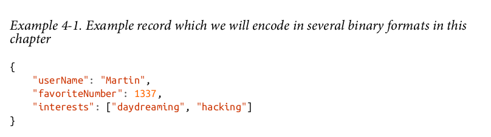
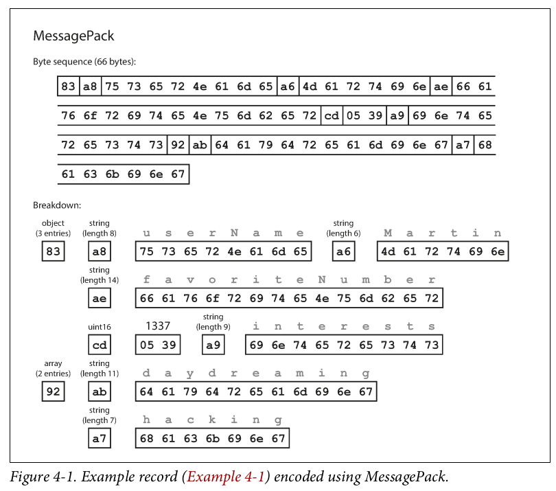
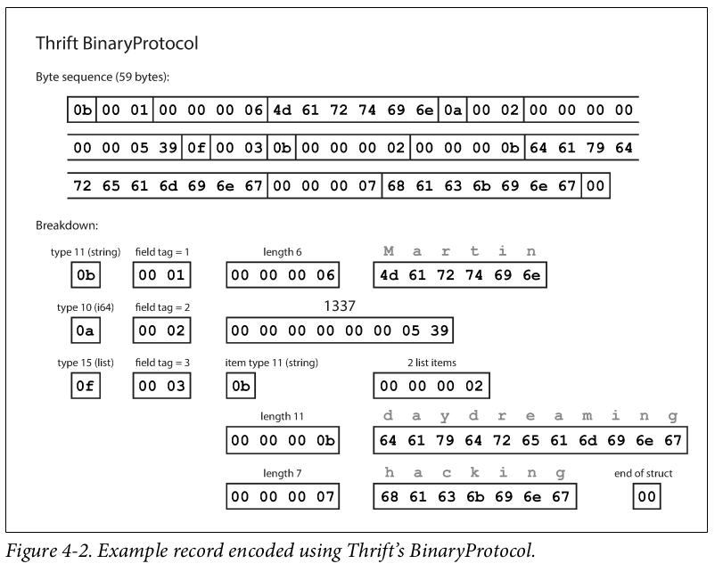
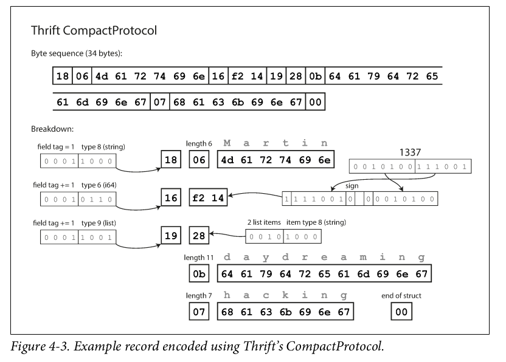
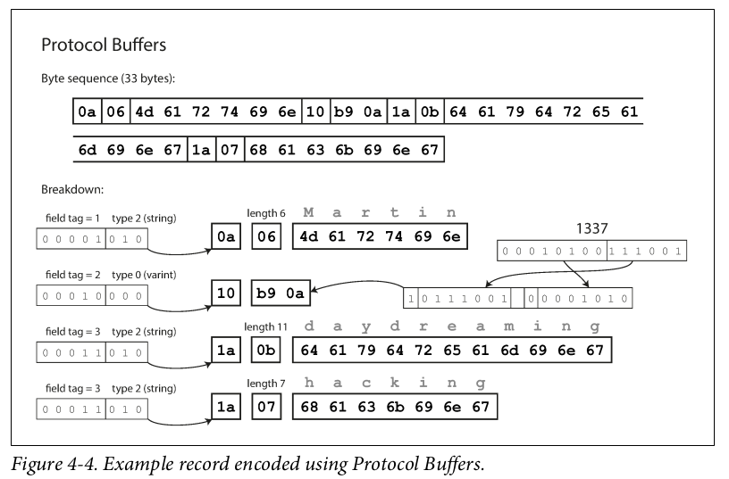
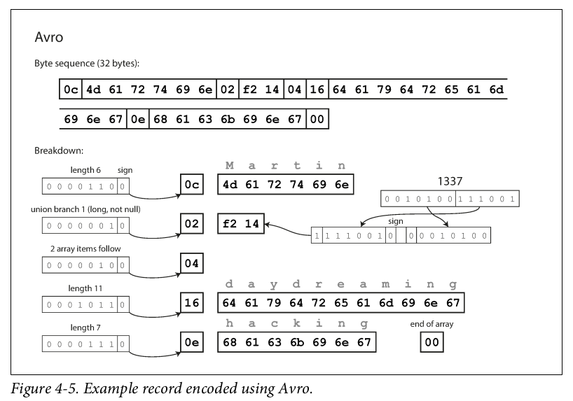
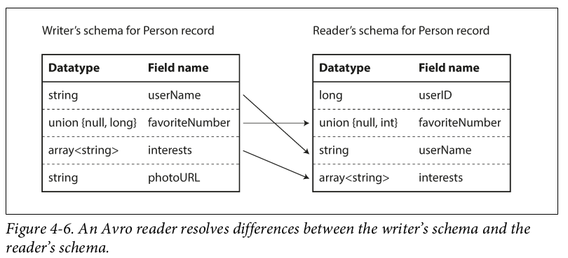

# Encoding and Evolution

Programs usually work with data in (at least) two different representations:
1. In memory, data is kept in objects, structs, lists, arrays, hash tables, trees, and so on. These data structures are optimized for efficient access and manipulation by the CPU (typically using pointers).
2. When you want to write data to a file or send it over the network, you have to encode it as some kind of self-contained sequence of bytes (for example, a JSON document). Since a pointer wouldn’t make sense to any other process, this sequence-of-bytes representation looks quite different from the data structures that are normally used in memory.

## Language-Specific Formats
Many programming languages come with built-in support for encoding in-memory
objects into byte sequences. ( is a bad idea)
* The encoding is often tied to a particular programming language, and reading
the data in another language is very difficult. If you store or transmit data in such an encoding, you are committing yourself to your current programming language for potentially a very long time, and precluding integrating your systems with those of other organizations (which may use different languages).
* In order to restore data in the same object types, the decoding process needs to be able to instantiate arbitrary classes. This is frequently a source of security problems
* Versioning data is often an afterthought in these libraries: as they are intended for quick and easy encoding of data, they often neglect the inconvenient problems of forward and backward compatibility.
* Efficiency (CPU time taken to encode or decode, and the size of the encoded
structure) is also often an afterthought. For example, Java’s built-in serialization
is notorious for its bad performance and bloated encoding.

## JSON, XML, and Binary Variants
JSON, XML, and CSV are textual formats, and thus somewhat human-readable (although the syntax is a popular topic of debate). Besides the superficial syntactic issues, they also have some subtle problems:
* There is a lot of ambiguity around the encoding of numbers. In XML and CSV, you cannot distinguish between a number and a string that happens to consist of digits (except by referring to an external schema). JSON distinguishes strings and numbers, but it doesn’t distinguish integers and floating-point numbers, and it doesn’t specify a precision.
This is a problem when dealing with large numbers; for example, integers greater than 2 53 cannot be exactly represented in an IEEE 754 double-precision floating-point number, so such numbers become inaccurate when parsed in a language that uses floating-point numbers (such as JavaScript). An example of numbers larger than 2 53 occurs on Twitter, which uses a 64-bit number to identify each tweet. The JSON returned by Twitter’s API includes tweet IDs twice, once as a JSON number and once as a decimal string, to work around the fact that the numbers are not correctly parsed by JavaScript applications.
* JSON and XML have good support for Unicode character strings (i.e., human-readable text), but they don’t support binary strings (sequences of bytes without a character encoding). Binary strings are a useful feature, so people get around this limitation by encoding the binary data as text using Base64. The schema is then used to indicate that the value should be interpreted as Base64-encoded. This works, but it’s somewhat hacky and increases the data size by 33%.
* There is optional schema support for both XML and JSON . These schema languages are quite powerful, and thus quite complicated to learn and implement. Use of XML schemas is fairly widespread, but many JSON-based tools don’t bother using schemas. Since the correct interpretation of data (such as numbers and binary strings) depends on information in the schema, applications that don’t use XML/JSON schemas need to potentially hardcode the appropriate encoding/decoding logic instead.

## Binary encoding
### Json
Example record in json 81 byte

### MessagePack
Example record in MessagePack 66 byte

### Thrift and Protocol Buffers

Thrift  
* BinaryProtocol
* CompactProtocol

#### BinaryProtocol
Example record in Thrift BinaryProtocol 59 byte

#### CompactProtocol
Example record in Thrift CompactProtocol 34 byte

### Protocol Buffers
Example record in Protocol Buffers 33 byte

### Avro
Example record in Protocol Buffers 32 byte

Avro  
* writer’s schema
* reader’s schema
An Avro reader resolves differences between the writer’s schema and the
reader’s schema.

## Backward and forward compatibility
Backward and forward compatibility in binary encoding formats means if a field is required you cant remove it and only optional field can be removed and also only optional field can be added or required field with default values and you can not use a tag twice 

## Modes of Dataflow
Data flows between processes :
* Via database 
* Via service calls ( REST and RPC(remote procedure calls) ) 
* Via asynchronous message passing

