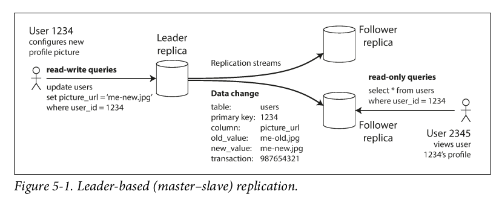
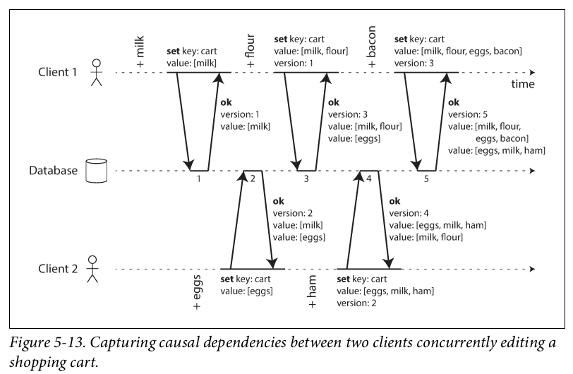
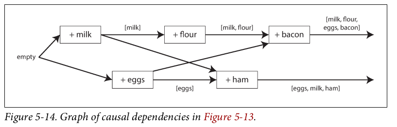

# Replication
## Why replication ?
* To keep data geographically near to client
* To increase availability
* To scale up number of machines that can serve read queries

## Replication approaches
### Leader based (master-slave)
Leader and followers architecture keep a copy of all data from leader in follower(async or/and sync)

* Handling node outages can happen auto (choose another node as leader and after coming back old leader clear data that are not written in new leader and make old leader new follower)
* Replica log have problem with non deterministic function like NOW() that may have different value in different replicas
* Reading your own write have problem if you use async follower and try to read your written data like comment. It may write to leader and read from follower that dosn't received data yet it looks data lost. it can be solved with read-your-write consistency that make sure users read their own write after write but for same user not others.
* Monotonic reads ( backward in time) read from a replica and for second query read from another replica that is not as update as previous one ( we can solve by making sure a user always use same replica
* In mongodb using sessions guarantees read-your-write and monotonic read and write
* Multi-leader configuration have conflict problems for write
* All to all topologies have problem that an update can be received before insert in one replica
* Quorums for reading and writing means we have n nodes and need w nodes to write successful and read from r nodes to vote up to date value and w+r > n
* Solving conflicts by client can happend with mearging concurrent values that update data structure if we write on last version and create another if write is concurrent ( see botom figures ) and for deletion client should mark data as deleted first and other clients delete data in merge and same client too.

Capturing causal dependencies between two clients concurrently editing a
shopping cart

Graph of causal dependencies

